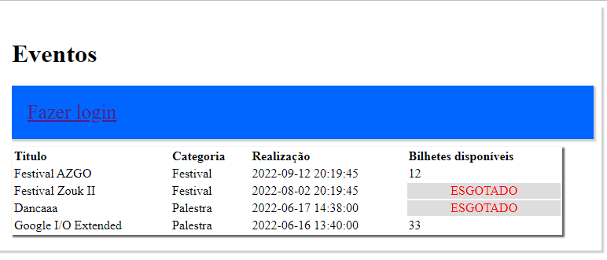
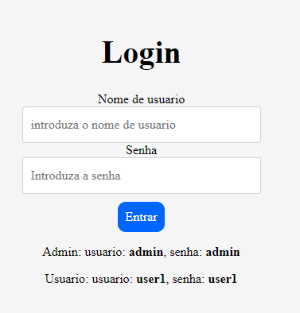
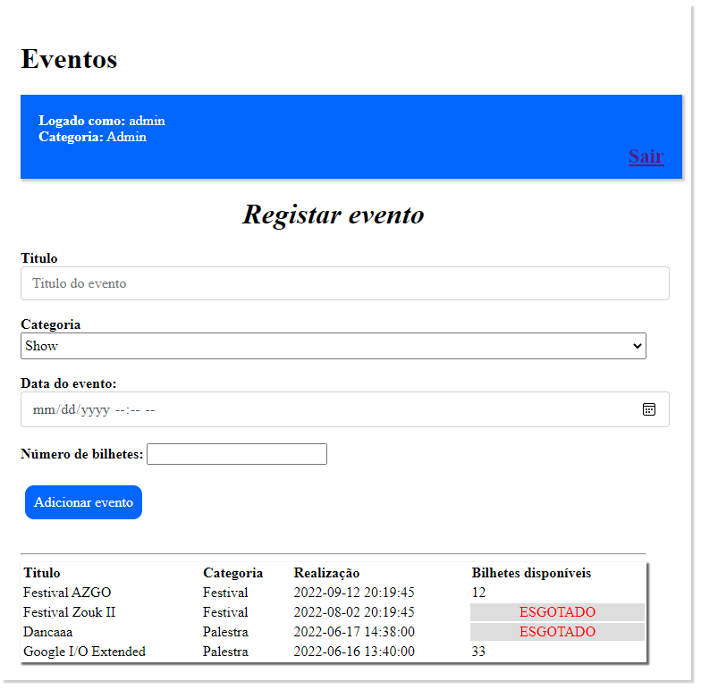
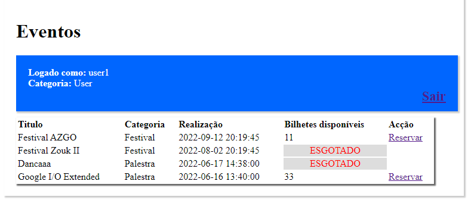

# Exercicios de PW

Repositório de resolução das fichas 6A, 6B e o Mini-teste.

## Ficha 6A

- [x] Exercicio 1
- [x] Exercicio 2
- [x] Exercicio 3
- [x] Exercicio 4
- [x] Exercicio 5
- [x] Exercicio 6
- [x] Exercicio 7

---

## Ficha 6B

> A Big Software Lda, pretende desenvolver uma aplicação para publicação e promoção de
> eventos. Sobre o evento pretende-se saber o título, categoria (show, teatro ou palestra),
> data de realização e o número de bilhetes disponíveis. O registo do evento será efectuado por
> um utilizador com privilégios de administrador. Utilizadores com privilégios de cliente,
> podem ter acesso aos eventos publicados e reservar bilhetes para os eventos. Todos
> utilizadores são inseridos diretamente na base de dados e acedem a aplicação através do
> email e password.
>
> - [x] a) Desenhe um formulário e implemente funções que permitam o registo de eventos. Todos os campos devem ser preenchidos, obrigatoriamente.

> - [x] b) Crie uma tela para listagem dos eventos registados. Se o evento não tiver bilhetes disponíveis, deve ser apresentada a mensagem “Esgotado” com a cor vermelha e o botão reservar só aparece para eventos dentro do prazo.

> - [x] c) Implemente funções que permitam ao utilizador, com privilégios de cliente, reservar bilhetes.

> - [x] d) Desenhe um formulário de autenticação e implemente funções que permitam fazer login e logout no sistema.

### Usuarios

| Tipo de usuário | Previlégios                                                       | Acesso (login)                                   |
| --------------- | ----------------------------------------------------------------- | ------------------------------------------------ |
| Administrador   | - Registar evento                                                 | username: admin password: admin               |
| Cliente         | - Acessar eventos publicados - Reservar bilhetes p/ os eventos | username: user1, user2 password: user1, user2 |

### Base de dados

> Obs: a base de dados acabou não ficando como está no esquema, tendo apenas as tabelas `evento` e `utilizador`.

### Telas

#### Tela Principal (inicio)

> A tela principal mostra todos os eventos registrados no sistema. Entretanto, para poder adicionar eventos (como admin) ou reservar bilhetes (como usuário), é necessário que se faça primeiro a entrada no sistema como um deles.

#### Tela de Login

> Como o sistema de registro de usuários não foi implementado, para a entrada no sistema usa-se dados de utilizador que foram directamente introduzidas na base de dados (em baixo temos os dois níveis de usuários com os respectivos dados para autenticação).

#### Tela de Registro de eventos

> Quando formos a entrar como admin, seremos redirecionados para a página principal. Ademais, logado como admin, será possível registar novos eventos.

#### Visualizar eventos

> Como um usuário com previlégios normais, nos será oferecido um botão extra na tabela para reservarmos os bilhetes. A cada vez que clicarmos no botão `reservar`, o numéro de **bilhetes disponíveis** será reduzido em 1. Caso o número de **bilhetes disponíveis** chegue a 0, já não mais será possível reservar e ao invés será mostrado uma mensagem: `ESGOTADO`.

---
