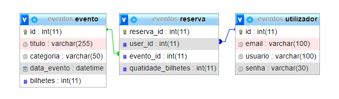

# Exercicios de PW

Repositório de resolução das fichas 6A, 6B e o Mini-teste.

## Ficha 6A

- [x] Exercicio 1
- [x] Exercicio 2
- [x] Exercicio 3
- [x] Exercicio 4
- [x] Exercicio 5
- [x] Exercicio 6
- [x] Exercicio 7

***

## Ficha 6B

> A Big Software Lda, pretende desenvolver uma aplicação para publicação e promoção de
eventos. Sobre o evento pretende-se saber o título, categoria (show, teatro ou palestra),
data de realização e o número de bilhetes disponíveis. O registo do evento será efectuado por
um utilizador com privilégios de administrador. Utilizadores com privilégios de cliente,
podem ter acesso aos eventos publicados e reservar bilhetes para os eventos. Todos
utilizadores são inseridos diretamente na base de dados e acedem a aplicação através do
email e password.
>
> - [ ] a) Desenhe um formulário e implemente funções que permitam o registo de eventos.
Todos os campos devem ser preenchidos, obrigatoriamente.
> - [ ] b) Crie uma tela para listagem dos eventos registados. Se o evento não tiver bilhetes
disponíveis, deve ser apresentada a mensagem “Esgotado” com a cor vermelha e o
botão reservar só aparece para eventos dentro do prazo.
> - [ ] c) Implemente funções que permitam ao utilizador, com privilégios de cliente, reservar
bilhetes.
> - [ ] d) Desenhe um formulário de autenticação e implemente funções que permitam fazer
login e logout no sistema.

### Usuarios

| Tipo de usuário | Previlégios                                                       | Acesso (login)                                                 |
|-----------------|-------------------------------------------------------------------|----------------------------------------------------------------|
| Administrador   | - Registar evento                                                 | username: admin password: admin                             |
| Cliente         | - Acessar eventos publicados - Reservar bilhetes p/ os eventos | username: user1, user2 password: user1, user2 |

### Base de dados

### Telas

#### :exclamation: Login

#### :exclamation: Registro de eventos

#### :exclamation: visualizar eventos

***
